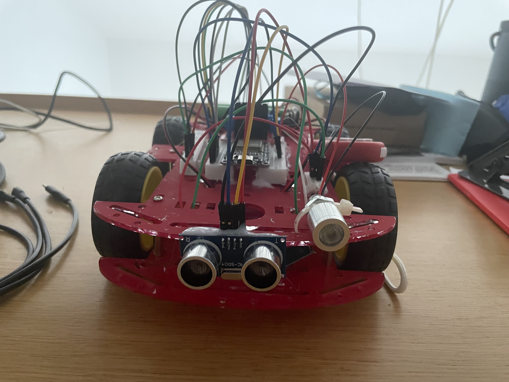
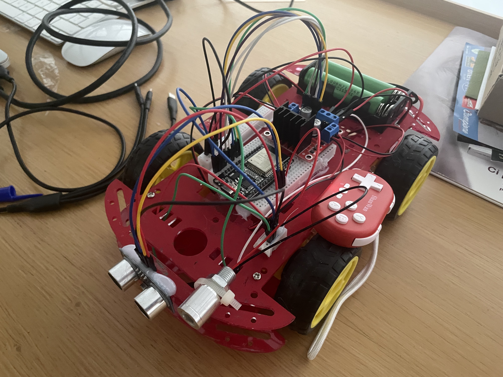
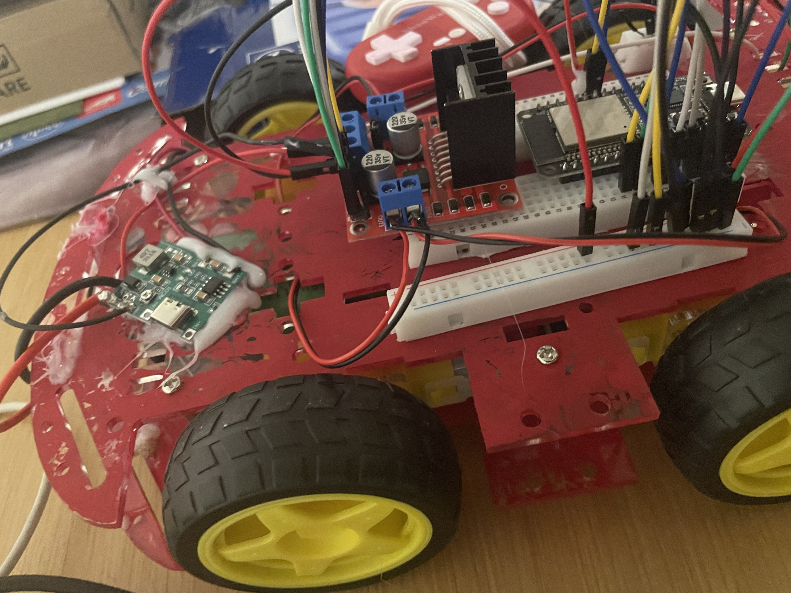

# Esp32 4WD Car Bluetooth
Esp32 4WD Car with Bluetooth Remote Control is an  project that can avoid obstacles and learn with your son.

## Components Details  

- **ESP32**: For development purposes, we use this board.  

- **L298N Motor Driver**: It controlled the motors with Bridge H circuit. 

- **4 DC Motors and Wheels**: It is used for moving the car (driving).  

- **Switch ON/OFF** It is used for turn on/off the power on circuit.

- **DC-DC SteUp Boost Module**: You can use a TP4056 Kit to reach this result.
  
- **LED 5V**: It is used for turn on/off.  

- **Bluetooth GamePad**: It's used to remote command the car.

- **2 18650 Battery (Rechargeable)**: It is used for providing voltage the circuit. Please put those in series. We aspect around 8.4 V.
  
- **ULTRASONIC SENSOR HCSR04**: It's used for detect object during driving the car.

- **Car Chassis**: The main body to attach other components (can use any PVC or cardboard as a base).

- **Jumper Wires**: Male-to-male and male-to-female connectors for the circuit (any normal wires can be used, though male-to-female connectors are necessary for connecting with esp).

- **Breadboard**: For connection the wires with others components we used this board.

- **Hot glued**: For connection the wires/devices/motors with others components we used this project.
- **Soldering iron**: For connection the wires with others components we used this board.

## Following Hardware Steps

1. First we attached the motors to a base. We connected them using the screw provided with the chassis. Glue gun can be used to attach the motors to the base.

   

   

2. Then connected both left motor's positive terminals to "outl" and negative terminals to "out2" of the L298N driver.

3. And repeated the process for the right motors and connected them to "out3" and "out4" of the motor driver.

4. After that we connected the battery with the motor driver. Positive terminal to 12V marked port. We marged the ground of the battery with the ESP32 ground connector to and connected it with the GND marked port. Lastly we connected the 5v from our ESP32 with the 5V maked port beside the GND of the driver so that the ESP32 board can take power from the motor driver.

5. We connected the ENA, IN1, IN2, IN3, IN4, ENB ports with the ESP32's D32, D26, D27, D13, D12 & D33 no pin respectively.

6. We removed both of the ENA and ENB jumpers so that we can control the speed of the motors using PWM. If anyone doesn't want to control the speed of the motors then they should leave the jumper on the board.

7. Install the Ultrasonic Sensor connect the GND to esp32 GND, VCC to 5V esp32, trig to D5 on esp32 and trigP to D18 on esp32.

8.  Install the Led 5V device with GND to esp32 GND, VCC  to D19 on esp32.
9. 

## Circuit Diagram

## Internal Control

- The bluetooth car app sends different characters for different functions and the ESP receives them and controls the motors using the L298N motor driver module. 
    - Basic Action :
Up → Up  
Down → Down  
Left → ‘Left’  
Right → ‘Right’

  - Features Action:
B button → 'B'
A button → 'A'

- To move forward the In1 and In3 gets HIGH and In2 and In4 gets LOW. and we send the PWM value to both ENA and ENB pins. So, all motors run forward according to the value from PWM.
  
- To move Backward the In1 and In3 gets LOW and In2 and In4 gets HIGH. We send the PWM value to both ENA and ENB pins. So, all motors run Backward according to the value from PWM.
  
- To move Left the In1 and In4 gets LOW and In2 and In3 gets HIGH. As a result the left runs backwards and the right motors run forward and the car turns left.

- To move Right the In1 and In4 gets HIGH and In2 and In3 gets LOW. As a result the right motors run backwards and the left motors run forward and the car turns right.

- Pressed the B Button, stop the car.
- 
- Pressed the A Button, turn on/off the Led.

## Following Software Steps

1. Download the [Arduino Ide](https://www.arduino.cc/en/software/) and begin to write a simple code to learn how turn on/off a simple build led inside the esp32. You can compile and upload the binary on esp32.
2. [Look this page and video](https://www.arduino.cc/en/software/). Install the [library](https://raw.githubusercontent.com/ricardoquesada/esp32-arduino-lib-builder/master/bluepad32_files/package_esp32_bluepad32_index.json) and install like in the video on your arduino Ide
3. In the end, yuo can retrieve the my code and setup the number of pin and command from your BL remote control.

## Pictures and Videos

